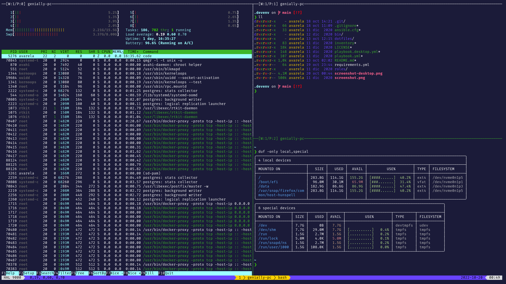

# artberri/devenv

A project to set up my development machine ([@artberri](https://github.com/artberri)) in an automated way.



## Requirements

Requires [Ubuntu 18.04 (Bionic Beaver)](http://releases.ubuntu.com/18.04/).

Git:

```bash
sudo apt-add-repository ppa:git-core/ppa -y
sudo apt-get update
sudo apt-get install git -y
```

## Installation

```bash
export DEVENV_PATH="${HOME}/.devenv"
git clone https://github.com/artberri/devenv.git $DEVENV_PATH
export PATH=$PATH:$DEVENV_PATH/bin
devenv
```

Finally, install some cool theme for the chosen terminal: [Dracula](https://draculatheme.com)

## Updating

``` bash
cd ~/.devenv
git pull
devenv
```

## License

[GNU GENERAL PUBLIC LICENSE (Version 2)](LICENSE)
